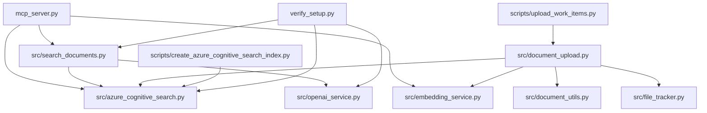

# Project Structure

## Overview

```
WorkItemDocumentationRetriever/
├── README.md                           # Main project documentation
├── COMPLETE_SETUP_GUIDE.md           # Detailed setup instructions
├── QUICK_SETUP.md                     # Quick 5-minute setup guide
├── VSCODE_MCP_SETUP.md               # VS Code MCP integration guide
├── requirements.txt                   # Python dependencies
├── .env.example                      # Environment variables template
├── .env                              # Environment variables (not tracked)
├── .gitignore                        # Git ignore rules
├── verify_setup.py                   # Setup verification script
├── start_mcp_server.bat              # Windows MCP server startup script
├── mcp_server.py                     # Main MCP server entry point
├── mcp_config.json                   # MCP configuration template
├── processed_files.json             # File processing tracking (generated)
├──
├── src/                              # Core application source code
│   ├── __init__.py
│   ├── azure_cognitive_search.py    # Azure Cognitive Search service
│   ├── document_upload.py           # Document processing and upload
│   ├── document_utils.py            # Document processing utilities
│   ├── embedding_service.py         # Embedding generation service
│   ├── file_tracker.py              # File processing tracking
│   ├── openai_service.py            # Azure OpenAI service integration
│   └── search_documents.py          # Search functionality
├──
├── scripts/                          # Utility scripts
│   ├── __init__.py
│   ├── create_azure_cognitive_search_index.py  # Index creation
│   ├── upload_work_items.py         # Batch document upload
│   └── upload_single_file.py        # Single file upload
├──
├── config/                           # Configuration files
│   ├── mcp_settings.json            # MCP-specific settings
│   └── settings.py                  # Application settings
├──
├── tests/                            # Test files
│   ├── __init__.py
│   ├── README.md
│   ├── test_end_to_end.py           # End-to-end tests
│   └── test_simple_e2e.py           # Simple E2E tests
├──
├── docs/                             # Documentation
│   ├── 01-Architecture.md           # System architecture
│   ├── AppDescription.md            # Application description
│   └── archive/                     # Archived planning documents
│       ├── 02-AzureSetup.md
│       ├── 03-DocumentUpload.md
│       ├── 04-MCPServerImplementation.md
│       ├── 05-Configuration.md
│       ├── 06-Timeline.md
│       ├── 08-SearchIntegrationPlan.md
│       ├── ProjectPlan.md
│       └── VIRTUAL_ENV_REQUIRED.md
└──
└── .vscode/                          # VS Code settings (if any)
```

## Key Files Description

### Core Application

- **`mcp_server.py`**: Main entry point for the MCP server
- **`src/azure_cognitive_search.py`**: Centralized Azure Search operations
- **`src/search_documents.py`**: Search functionality wrapper
- **`src/document_upload.py`**: Document processing and indexing pipeline
- **`src/openai_service.py`**: Azure OpenAI integration
- **`src/embedding_service.py`**: Embedding generation with rate limiting

### Setup and Configuration

- **`COMPLETE_SETUP_GUIDE.md`**: Step-by-step setup instructions
- **`verify_setup.py`**: Automated setup verification
- **`.env.example`**: Template for environment variables
- **`requirements.txt`**: Python package dependencies

### Utilities

- **`scripts/create_azure_cognitive_search_index.py`**: Creates search index
- **`scripts/upload_work_items.py`**: Batch upload utility
- **`start_mcp_server.bat`**: Windows batch file for easy server startup

### Documentation

- **`README.md`**: Main project overview and usage
- **`docs/01-Architecture.md`**: Technical architecture details
- **`docs/archive/`**: Historical planning documents

## File Dependencies



## Generated/Runtime Files

These files are created during operation:

- **`processed_files.json`**: Tracks which files have been processed
- **`__pycache__/`**: Python bytecode cache (ignored by git)
- **`*.log`**: Log files (ignored by git)

## Environment Files

- **`.env`**: Contains sensitive credentials (never commit)
- **`.env.example`**: Template showing required environment variables
