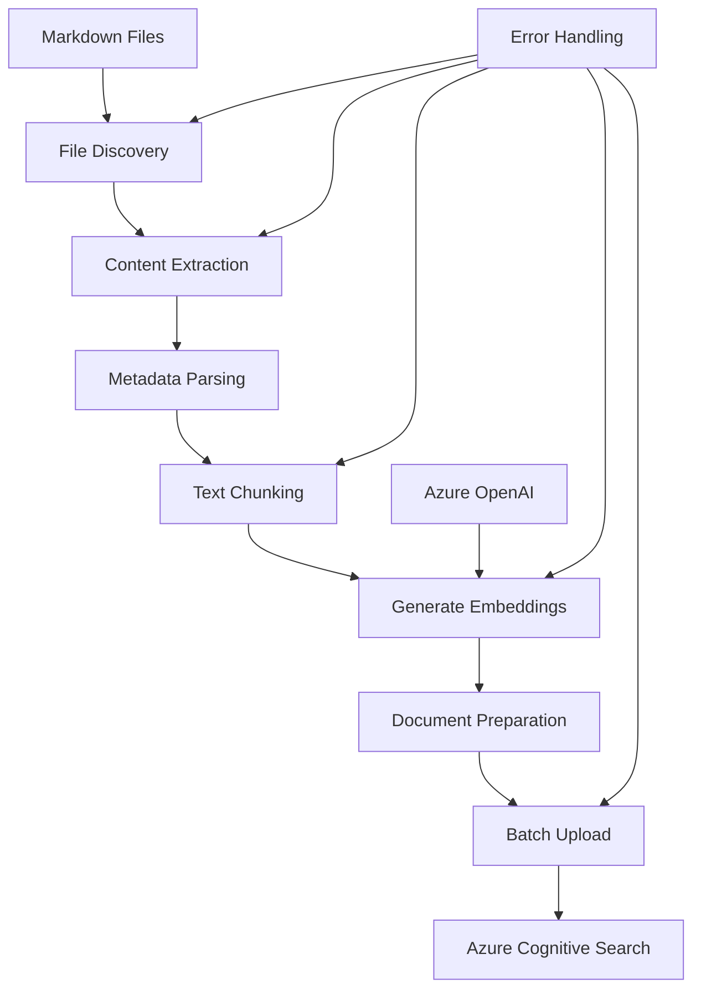

# Document Upload to Azure Cognitive Search

## Overview

This guide provides practical implementation details for uploading work item documentation from a structured local directory to Azure Cognitive Search with vector embeddings.

**Directory Structure Expected:**

- Root folder: `"Work Items"` on desktop
- Organization: Each work item has its own subdirectory
- Directory names serve as work item identifiers
- Markdown files within each subdirectory contain the documentation

The implementation focuses on the essential components needed for the WorkItemDocumentationRetriever project.

## Table of Contents

1. [Index Schema Design](#index-schema-design)
2. [Document Processing Pipeline](#document-processing-pipeline)
3. [Upload Implementation](#upload-implementation)

---

# Index Schema Design

## Azure Cognitive Search Index Schema

The following schema is optimized for work item document search with vector capabilities:

```json
{
  "name": "work-items-index",
  "fields": [
    {
      "name": "id",
      "type": "Edm.String",
      "key": true, // Document key - required, unique
      "searchable": false, // Not needed for full-text search
      "filterable": true, // Enables exact ID lookups
      "retrievable": true, // Return in results
      "sortable": false, // IDs rarely need sorting
      "facetable": false // IDs not useful for faceting
    },
    {
      "name": "content",
      "type": "Edm.String",
      "searchable": true, // Enable full-text search
      "filterable": false, // Large text not suitable for filtering
      "retrievable": true, // Show content in results
      "sortable": false, // Content too large to sort effectively
      "facetable": false, // Content not suitable for faceting
      "analyzer": "standard.lucene" // Standard text analysis
    },
    {
      "name": "content_vector",
      "type": "Collection(Edm.Single)",
      "searchable": true, // Required for vector search
      "filterable": false, // Vectors not filterable
      "retrievable": false, // Don't return raw vectors (save bandwidth)
      "stored": false, // Don't store extra copy (save storage)
      "sortable": false, // Vectors not sortable
      "facetable": false, // Vectors not facetable
      "dimensions": 1536, // text-embedding-ada-002 dimensions
      "vectorSearchProfile": "vector-profile" // Links to vector config
    },
    {
      "name": "file_path",
      "type": "Edm.String",
      "searchable": false, // File paths not for full-text search
      "filterable": true, // Filter by specific files/directories
      "retrievable": true, // Show source file in results
      "sortable": false, // Sorting by path rarely needed
      "facetable": true // Group results by directory/file type
    },
    {
      "name": "title",
      "type": "Edm.String",
      "searchable": true, // Titles are highly searchable
      "filterable": false, // Exact title filtering rare
      "retrievable": true, // Show title in results
      "sortable": false, // Title sorting not typically needed
      "facetable": false // Titles too varied for faceting
    },
    {
      "name": "work_item_id",
      "type": "Edm.String",
      "searchable": false, // IDs are exact-match only
      "filterable": true, // Filter by work item ID
      "retrievable": true, // Show work item ID in results
      "sortable": false, // ID sorting rarely useful
      "facetable": true // Group by work item
    },
    {
      "name": "tags",
      "type": "Collection(Edm.String)",
      "searchable": true, // Search within tags
      "filterable": true, // Filter by specific tags
      "retrievable": true, // Show tags in results
      "sortable": false, // Tag arrays not sortable
      "facetable": true // Facet navigation by tags
    },
    {
      "name": "last_modified",
      "type": "Edm.DateTimeOffset",
      "searchable": false, // Dates not for text search
      "filterable": true, // Filter by date ranges
      "retrievable": true, // Show modification date
      "sortable": true, // Sort by recency
      "facetable": false // Date faceting complex, better as ranges
    },
    {
      "name": "chunk_index",
      "type": "Edm.Int32",
      "searchable": false, // Numbers not for text search
      "filterable": true, // Filter by chunk position
      "retrievable": true, // Show chunk order
      "sortable": true, // Sort chunks by position
      "facetable": false // Chunk numbers not useful for faceting
    }
  ],

  // Vector Search Configuration
  "vectorSearch": {
    "profiles": [
      {
        "name": "vector-profile",
        "algorithm": "hnsw-algorithm" // Reference to algorithm configuration
      }
    ],
    "algorithms": [
      {
        "name": "hnsw-algorithm",
        "kind": "hnsw", // HNSW algorithm type
        "hnswParameters": {
          "metric": "cosine", // Best for Azure OpenAI embeddings
          "m": 4, // Bi-directional links (4-10)
          "efConstruction": 400, // Index quality (100-1000)
          "efSearch": 500 // Search quality (100-1000)
        }
      }
    ]
  }
}
```

### Schema Design Rationale

#### Field Selection Strategy

1. **Document Key (`id`)**: Unique identifier for deduplication and updates
2. **Content Fields**: Separate storage for human-readable content and vector embeddings
3. **Metadata Fields**: Structured information for filtering and faceting
4. **Navigation Fields**: Support for organizing and browsing results

#### Vector Configuration Explained

- **Profile**: Named configuration that fields can reference
- **Algorithm**: HNSW chosen for balanced performance and accuracy
- **Cosine Similarity**: Optimal for normalized embeddings from Azure OpenAI
- **Parameters**: Tuned for good performance with moderate resource usage

---

# Document Processing Pipeline

This section provides practical implementation details for processing and uploading documents to Azure Cognitive Search.

## Architecture Overview



## Processing Stages Explained

### 1. **File Discovery and Reading**

- Recursively scan directories for markdown files
- Handle various file encodings and formats
- Extract frontmatter metadata when present
- Parse document structure and content

### 2. **Content Processing**

- Clean and normalize text content
- Extract meaningful metadata (titles, IDs, tags)
- Handle different markdown syntax variations
- Preserve important formatting context

### 3. **Text Chunking Strategy**

- Split large documents into searchable chunks
- Maintain semantic coherence within chunks
- Create overlapping segments for context preservation
- Optimize chunk sizes for embedding models

### 4. **Embedding Generation**

- Convert text chunks to vector embeddings
- Use Azure OpenAI text-embedding models
- Implement batch processing for efficiency
- Handle rate limiting and error scenarios

### 5. **Document Upload**

- Prepare documents in search index format
- Batch upload for optimal performance
- Implement retry logic for failed uploads
- Validate document structure and field mappings

### Step 1: File Discovery and Reading

```python
import os
from pathlib import Path
from typing import List, Dict, Optional
import frontmatter
import re

def discover_markdown_files(work_items_path: str) -> List[Path]:
    """Find all markdown files in the Work Items directory structure"""
    work_items_dir = Path(work_items_path)

    if not work_items_dir.exists():
        raise FileNotFoundError(f"Work Items directory does not exist: {work_items_path}")

    markdown_files = []

    # Iterate through each work item subdirectory
    for work_item_dir in work_items_dir.iterdir():
        if work_item_dir.is_dir():
            # Find all .md files in this work item directory
            work_item_md_files = list(work_item_dir.rglob("*.md"))

            # Filter out empty files and add to main list
            valid_files = [f for f in work_item_md_files if f.is_file() and f.stat().st_size > 0]
            markdown_files.extend(valid_files)

    return sorted(markdown_files)

def extract_metadata(content: str, file_path: Path) -> Dict:
    """Extract metadata from file content and directory structure"""
    try:
        # Parse frontmatter if present
        # Note: Frontmatter is YAML metadata at the top of markdown files,
        # enclosed between '---' markers (e.g., title, tags, date)
        post = frontmatter.loads(content)
        metadata = dict(post.metadata) if post.metadata else {}

        # Extract work item ID from directory name (this is the key change)
        work_item_dir = file_path.parent
        work_item_id = work_item_dir.name  # Directory name is the work item ID
        metadata['work_item_id'] = work_item_id

        # Extract title (priority: frontmatter > first heading > filename)
        if 'title' not in metadata:
            title_match = re.search(r'^#\s+(.+)$', content, re.MULTILINE)
            metadata['title'] = (
                title_match.group(1).strip() if title_match
                else file_path.stem.replace('_', ' ').replace('-', ' ')
            )

        # Extract tags from frontmatter or content
        if 'tags' not in metadata:
            tags = set()

            # From frontmatter
            if 'tags' in post.metadata:
                fm_tags = post.metadata['tags']
                if isinstance(fm_tags, list):
                    tags.update(str(tag).strip() for tag in fm_tags)
                elif isinstance(fm_tags, str):
                    tags.update(tag.strip() for tag in fm_tags.split(','))

            # From hashtags in content
            hashtags = re.findall(r'#(\w+)', content)
            tags.update(hashtags)

            # Add work item ID as a tag for easier searching
            tags.add(work_item_id)

            metadata['tags'] = sorted(list(tags)) if tags else [work_item_id]

        # File system metadata
        file_stat = file_path.stat()
        metadata['last_modified'] = file_stat.st_mtime
        metadata['work_item_directory'] = str(work_item_dir)

        return metadata

    except Exception as e:
        # Return minimal metadata on error, but always include work item ID
        work_item_id = file_path.parent.name
        return {
            'title': file_path.stem.replace('_', ' ').replace('-', ' '),
            'work_item_id': work_item_id,
            'last_modified': file_path.stat().st_mtime,
            'tags': [work_item_id],
            'work_item_directory': str(file_path.parent)
        }

def read_markdown_file(file_path: Path) -> Optional[Dict]:
    """Read and parse a markdown file"""
    try:
        # Read file content
        content = file_path.read_text(encoding='utf-8')

        if not content.strip():
            return None  # Skip empty files

        # Extract metadata
        metadata = extract_metadata(content, file_path)

        # Remove frontmatter from content
        post = frontmatter.loads(content)
        clean_content = post.content if post.metadata else content

        return {
            'content': clean_content.strip(),
            'file_path': str(file_path),
            'metadata': metadata
        }

    except Exception as e:
        print(f"Error reading {file_path}: {e}")
        return None
```

## Usage Example

````python
# Usage for Work Items directory structure
from pathlib import Path

def process_work_items_directory(work_items_path: str):
    """Process all markdown files in the Work Items directory structure"""

    # Discover files across all work item subdirectories
    files = discover_markdown_files(work_items_path)
    print(f"Found {len(files)} markdown files across work item directories")

    # Group files by work item for processing
    work_items = {}
    processed_files = []

    for file_path in files:
        file_data = read_markdown_file(file_path)
        if file_data:
            work_item_id = file_data['metadata']['work_item_id']

            # Group by work item ID
            if work_item_id not in work_items:
                work_items[work_item_id] = []
            work_items[work_item_id].append(file_data)

            processed_files.append(file_data)
            print(f"Processed: {file_data['metadata']['title']} (Work Item: {work_item_id})")

    print(f"\nSummary:")
    print(f"- Total files processed: {len(processed_files)}")
    print(f"- Unique work items: {len(work_items)}")

    for work_item_id, files in work_items.items():
        print(f"  - {work_item_id}: {len(files)} files")

    return processed_files

# Example usage - point to your desktop Work Items folder
work_items_path = r"C:\Users\YourUsername\Desktop\Work Items"
documents = process_work_items_directory(work_items_path)
```### Step 2: Simple Text Chunking

```python
import re

def simple_chunk_text(content: str, max_chunk_size: int = 4000, overlap: int = 200) -> List[str]:
    """Split text into chunks with simple sentence-based splitting"""

    # Split by paragraphs first
    paragraphs = [p.strip() for p in content.split('\n\n') if p.strip()]

    chunks = []
    current_chunk = ""

    for paragraph in paragraphs:
        # If paragraph is too long, split by sentences
        if len(paragraph) > max_chunk_size:
            sentences = re.split(r'(?<=[.!?])\s+', paragraph)

            for sentence in sentences:
                if len(current_chunk) + len(sentence) > max_chunk_size:
                    if current_chunk:
                        chunks.append(current_chunk.strip())
                        # Create overlap with last few words
                        overlap_text = ' '.join(current_chunk.split()[-20:]) if current_chunk else ""
                        current_chunk = overlap_text + " " + sentence if overlap_text else sentence
                    else:
                        current_chunk = sentence
                else:
                    current_chunk = current_chunk + " " + sentence if current_chunk else sentence
        else:
            # Check if adding this paragraph exceeds limit
            if len(current_chunk) + len(paragraph) > max_chunk_size:
                if current_chunk:
                    chunks.append(current_chunk.strip())
                    # Create overlap
                    overlap_text = ' '.join(current_chunk.split()[-20:]) if current_chunk else ""
                    current_chunk = overlap_text + "\n\n" + paragraph if overlap_text else paragraph
                else:
                    current_chunk = paragraph
            else:
                current_chunk = current_chunk + "\n\n" + paragraph if current_chunk else paragraph

    # Add final chunk
    if current_chunk.strip():
        chunks.append(current_chunk.strip())

    # Return all chunks without filtering by length
    return chunks

def process_document_chunks(file_data: Dict) -> List[str]:
    """Process a document and return text chunks"""
    content = file_data['content']
    return simple_chunk_text(content)
````

            # Start new chunk with overlap and current sentence
            current_chunk = overlap_buffer + " " + sentence if overlap_buffer else sentence

    # Add the last chunk
    if current_chunk:
        chunks.append(current_chunk.strip())

    # Filter out very short chunks
    chunks = [chunk for chunk in chunks if len(chunk.strip()) > 50]

    return chunks

````

### Step 3: Generate Embeddings

```python
from openai import AzureOpenAI
from typing import List
import asyncio
import time

class EmbeddingGenerator:
    def __init__(self, client: AzureOpenAI, deployment_name: str):
        self.client = client
        self.deployment_name = deployment_name

    async def generate_embeddings_batch(self, texts: List[str], batch_size: int = 16) -> List[List[float]]:
        """Generate embeddings for text chunks in batches with rate limiting"""
        all_embeddings = []

        for i in range(0, len(texts), batch_size):
            batch = texts[i:i + batch_size]

            try:
                # Add delay to respect rate limits
                if i > 0:
                    await asyncio.sleep(1)  # 1 second between batches

                response = self.client.embeddings.create(
                    input=batch,
                    model=self.deployment_name  # Use your deployment name
                )

                batch_embeddings = [data.embedding for data in response.data]
                all_embeddings.extend(batch_embeddings)

                print(f"Generated embeddings for batch {i//batch_size + 1}/{(len(texts) + batch_size - 1)//batch_size}")

            except Exception as e:
                print(f"Error generating embeddings for batch {i//batch_size + 1}: {e}")
                # Add empty embeddings for failed batch to maintain alignment
                empty_embedding = [0.0] * 1536  # Dimension for text-embedding-ada-002
                all_embeddings.extend([empty_embedding] * len(batch))

        return all_embeddings
```

---

# Upload Implementation

## Simple Upload Function

```python
from azure.search.documents import SearchClient
from azure.core.credentials import AzureKeyCredential
from pathlib import Path
import time

def upload_to_search(documents, service_name, admin_key, index_name):
    """Upload processed documents to Azure Cognitive Search"""

    # Initialize search client
    search_client = SearchClient(
        endpoint=f"https://{service_name}.search.windows.net",
        index_name=index_name,
        credential=AzureKeyCredential(admin_key)
    )

    # Prepare documents for upload
    search_documents = []

    for doc in documents:
        for i, (chunk, embedding) in enumerate(zip(doc['chunks'], doc['embeddings'])):
            file_name = Path(doc['file_path']).stem
            doc_id = f"{file_name}_chunk_{i}".replace(" ", "_")

            search_doc = {
                'id': doc_id,
                'content': chunk,
                'content_vector': embedding,
                'file_path': doc['file_path'],
                'title': doc['metadata'].get('title', ''),
                'work_item_id': doc['metadata'].get('work_item_id', ''),
                'tags': doc['metadata'].get('tags', []),
                'last_modified': doc['metadata'].get('last_modified'),
                'chunk_index': i
            }
            search_documents.append(search_doc)

    # Upload documents
    try:
        result = search_client.upload_documents(documents=search_documents)
        print(f"Uploaded {len(search_documents)} documents")
        return True
    except Exception as e:
        print(f"Upload failed: {e}")
        return False
```

## Complete Processing Script

```python
import os
import asyncio
from pathlib import Path
from openai import AzureOpenAI

async def main():
    """Main processing function for Work Items directory structure"""

    # Configuration - set these in your environment
    work_items_path = os.getenv('WORK_ITEMS_PATH', r"C:\Users\YourUsername\Desktop\Work Items")
    azure_openai_endpoint = os.getenv('AZURE_OPENAI_ENDPOINT')
    azure_openai_key = os.getenv('AZURE_OPENAI_KEY')
    embedding_deployment = os.getenv('EMBEDDING_DEPLOYMENT', 'text-embedding-ada-002')
    search_service_name = os.getenv('AZURE_SEARCH_SERVICE')
    search_admin_key = os.getenv('AZURE_SEARCH_KEY')
    search_index_name = os.getenv('AZURE_SEARCH_INDEX', 'work-items-index')

    # Initialize Azure OpenAI client
    openai_client = AzureOpenAI(
        azure_endpoint=azure_openai_endpoint,
        api_key=azure_openai_key,
        api_version="2024-07-01"
    )

    # Process documents from Work Items directory structure
    markdown_files = discover_markdown_files(work_items_path)
    print(f"Found {len(markdown_files)} markdown files across work item directories")

    all_documents = []
    work_items_summary = {}

    for file_path in markdown_files:
        try:
            # Read and parse file
            file_data = read_markdown_file(file_path)
            if not file_data:
                continue

            work_item_id = file_data['metadata']['work_item_id']

            # Track work items for summary
            if work_item_id not in work_items_summary:
                work_items_summary[work_item_id] = 0
            work_items_summary[work_item_id] += 1

            # Create chunks
            chunks = process_document_chunks(file_data)

            # Generate embeddings using the EmbeddingGenerator class
            embedding_generator = EmbeddingGenerator(openai_client, embedding_deployment)
            embeddings = await embedding_generator.generate_embeddings_batch(chunks)

            all_documents.append({
                'file_path': str(file_path),
                'metadata': file_data['metadata'],
                'chunks': chunks,
                'embeddings': embeddings
            })

            print(f"Processed: {file_data['metadata']['title']} (Work Item: {work_item_id})")

        except Exception as e:
            print(f"Error processing {file_path}: {e}")

    # Print summary
    print(f"\nProcessing Summary:")
    print(f"- Total files processed: {len(all_documents)}")
    print(f"- Unique work items: {len(work_items_summary)}")
    for work_item_id, file_count in work_items_summary.items():
        print(f"  - {work_item_id}: {file_count} files")

    # Upload to Azure Cognitive Search
    success = upload_to_search(
        all_documents, search_service_name, search_admin_key, search_index_name
    )

    if success:
        total_chunks = sum(len(doc['chunks']) for doc in all_documents)
        print(f"Successfully uploaded {total_chunks} chunks from {len(all_documents)} files")
        print(f"Documents are now searchable by work item ID and content")

if __name__ == "__main__":
    asyncio.run(main())
```

## Environment Setup

Create a `.env` file with your configuration:

```bash
# Path to Work Items directory on desktop
WORK_ITEMS_PATH=C:\Users\YourUsername\Desktop\Work Items

# Azure OpenAI Configuration
AZURE_OPENAI_ENDPOINT=https://your-openai.openai.azure.com/
AZURE_OPENAI_KEY=your-openai-key
EMBEDDING_DEPLOYMENT=text-embedding-ada-002

# Azure Cognitive Search Configuration
AZURE_SEARCH_SERVICE=your-search-service
AZURE_SEARCH_KEY=your-search-admin-key
AZURE_SEARCH_INDEX=work-items-index
```

**Important Notes:**
- Update `WORK_ITEMS_PATH` to point to your actual "Work Items" folder on desktop
- Each subdirectory in "Work Items" should be named with the work item identifier
- Only `.md` files will be processed; other files in the directories will be ignored
````
