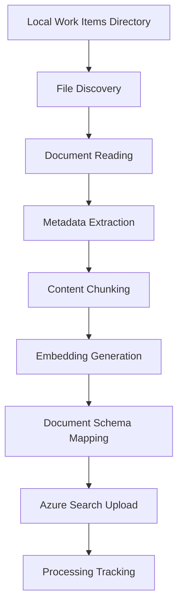

# Document Upload Process and Cognitive Search Schema Analysis

## Overview

This document provides a comprehensive analysis of how documents are processed and uploaded to Azure Cognitive Search in the Work Item Documentation system. It covers the complete data flow, schema mapping, and codebase locations for each step.

## 🔄 Document Upload Workflow

### High-Level Process Flow



---

## 📋 Azure Cognitive Search Schema

The system creates a comprehensive search index with the following fields:

### Index Fields Definition

| Field Name       | Data Type          | Purpose                                  | Searchable | Filterable | Facetable | Sortable |
| ---------------- | ------------------ | ---------------------------------------- | ---------- | ---------- | --------- | -------- |
| `id`             | String             | Unique document identifier (Primary Key) | ❌         | ✅         | ❌        | ❌       |
| `content`        | String             | Processed document text chunk            | ✅         | ❌         | ❌        | ❌       |
| `content_vector` | Collection(Single) | 1536-dimensional embedding vector        | ✅         | ❌         | ❌        | ❌       |
| `file_path`      | String             | Full path to source file                 | ❌         | ✅         | ✅        | ❌       |
| `title`          | String             | Document title                           | ✅         | ❌         | ❌        | ❌       |
| `work_item_id`   | String             | Work item identifier                     | ❌         | ✅         | ✅        | ❌       |
| `tags`           | String             | Comma-separated tags                     | ✅         | ✅         | ✅        | ❌       |
| `last_modified`  | DateTimeOffset     | File modification timestamp              | ❌         | ✅         | ❌        | ✅       |
| `chunk_index`    | Int32              | Sequential chunk number within document  | ❌         | ✅         | ❌        | ✅       |

### Search Capabilities Configuration

- **Vector Search**: HNSW algorithm with cosine similarity
- **Semantic Search**: Azure's semantic ranking for relevance
- **Full-Text Search**: Lucene analyzer for text processing

---

## 📁 Detailed Process Analysis

### 1. File Discovery Phase

**Location**: `src/upload/document_utils.py` - `discover_markdown_files()`

**Process**:

```python
def discover_markdown_files(work_items_path: str) -> List[Path]:
    # Scans directory structure for .md files
    # Supports both specific work item dirs and full Work Items directory
    # Filters out empty files (0 bytes)
```

**Input**: Work Items directory path (from `WORK_ITEMS_PATH` environment variable)
**Output**: Sorted list of valid markdown file paths

### 2. Document Reading and Parsing

**Location**: `src/upload/document_utils.py` - `read_markdown_file()`

**Process**:

- Reads file content using UTF-8 encoding
- Parses YAML frontmatter using `python-frontmatter` library
- Separates metadata from content
- Returns structured document data

**Input**: Individual file path
**Output**: Dictionary with `content`, `file_path`, and `metadata`

### 3. Metadata Extraction

**Location**: `src/upload/document_utils.py` - `extract_metadata()`

**Extraction Sources**:

#### From YAML Frontmatter

```yaml
---
title: "Document Title"
tags: ["tag1", "tag2"]
custom_field: "value"
---
```

#### From Content Analysis

- **Title**: First `# heading` in markdown
- **Tags**: Hashtags in content (`#tagname`)

#### From File System

- **Work Item ID**: Parent directory name
- **Last Modified**: File modification timestamp converted to ISO format

#### From Directory Structure

```
Work Items/
├── WI-12345/          ← work_item_id = "WI-12345"
│   ├── doc1.md
│   └── doc2.md
└── BUG-67890/         ← work_item_id = "BUG-67890"
    └── analysis.md
```

**Metadata Priority Order**:

1. YAML frontmatter values (highest)
2. Content-derived values
3. File system metadata
4. Default values (lowest)

### 4. Content Chunking

**Location**: `src/upload/document_utils.py` - `simple_chunk_text()`

**Chunking Strategy**:

```python
def simple_chunk_text(content: str, max_chunk_size: int = 4000, overlap: int = 200):
    # 1. Split by paragraphs (\n\n)
    # 2. If paragraph > max_chunk_size, split by sentences
    # 3. Create overlapping chunks (last 20 words)
    # 4. Ensure chunks don't exceed max_chunk_size
```

**Parameters**:

- **Max Chunk Size**: 4000 characters
- **Overlap**: 200 characters (last 20 words)
- **Strategy**: Paragraph-first, then sentence-based splitting

### 5. Embedding Generation

**Location**: `src/common/embedding_service.py` - `EmbeddingGenerator`

**Process**:

```python
# Generate embeddings for each text chunk
embeddings = await embedding_generator.generate_embeddings_batch(chunks)

# Validation and fallback
for embedding in embeddings:
    if not embedding_generator.validate_embedding(embedding):
        # Use zero vector as fallback
        valid_embeddings.append(embedding_generator.get_empty_embedding())
```

**Configuration**:

- **Model**: `text-embedding-ada-002` (Azure OpenAI)
- **Dimensions**: 1536
- **Batch Processing**: Multiple chunks processed together
- **Validation**: Ensures embedding quality before upload

### 6. Document Upload to Azure Search

**Location**: `src/common/azure_cognitive_search.py` - `upload_document()`

**Schema Mapping Process**:

#### Document ID Generation

```python
file_hash = hashlib.md5(document['file_path'].encode()).hexdigest()[:8]
doc_id = f"{file_hash}_{chunk_index}"
```

#### Field Population Logic

```python
search_doc = {
    'id': doc_id,                    # Generated unique ID
    'content': chunk,                # Text chunk content
    'content_vector': embedding,     # 1536-dimensional vector
    'file_path': document['file_path'],         # Full file path
    'title': metadata.get('title', file_name), # Title with fallback
    'work_item_id': metadata.get('work_item_id', 'Unknown'), # Directory name
    'tags': tags_str,                # Comma-separated tags string
    'last_modified': metadata.get('last_modified', utc_now), # ISO timestamp
    'chunk_index': chunk_index       # Sequential chunk number
}
```

---

## 🗂️ Value Population Details

### Field-by-Field Population Analysis

#### 1. `id` Field

- **Source**: Generated
- **Format**: `{file_hash}_{chunk_index}`
- **Example**: `a1b2c3d4_0`, `a1b2c3d4_1`
- **Purpose**: Unique identifier for each document chunk

#### 2. `content` Field

- **Source**: Processed text chunk from `simple_chunk_text()`
- **Processing**:
  - Frontmatter removed
  - Split into optimally-sized chunks
  - Whitespace normalized
- **Example**: "This is the content of the first chunk..."

#### 3. `content_vector` Field

- **Source**: Azure OpenAI `text-embedding-ada-002`
- **Format**: Array of 1536 floating-point numbers
- **Validation**: Checked for proper dimensions and non-null values
- **Fallback**: Zero vector if generation fails

#### 4. `file_path` Field

- **Source**: Original file path
- **Format**: Absolute path string
- **Example**: `C:\Users\user\Work Items\WI-12345\requirements.md`

#### 5. `title` Field

- **Source Priority**:
  1. YAML frontmatter `title` field
  2. First markdown heading (`# Heading`)
  3. Filename (underscore/hyphen to spaces)
- **Example**: "Project Requirements Document"

#### 6. `work_item_id` Field

- **Source**: Parent directory name
- **Processing**: Direct extraction from directory structure
- **Example**: `WI-12345`, `BUG-67890`, `FEATURE-11111`

#### 7. `tags` Field

- **Source Combination**:
  1. YAML frontmatter `tags` (list or comma-separated string)
  2. Hashtags from content (`#tag`)
  3. Work item ID automatically added
- **Format**: Comma-separated string
- **Example**: "authentication, security, WI-12345"

#### 8. `last_modified` Field

- **Source**: File system modification time
- **Format**: ISO 8601 with 'Z' suffix
- **Processing**: Unix timestamp → ISO format
- **Example**: "2025-08-13T14:30:15.123Z"

#### 9. `chunk_index` Field

- **Source**: Sequential numbering during chunking
- **Format**: Integer starting from 0
- **Purpose**: Maintains chunk order for document reconstruction

---

## 🔍 Codebase Location Reference

### Core Upload Flow

```
src/upload/document_upload.py
├── main() - Main orchestration function
├── upload_document_to_search() - Individual document upload
└── Calls to utility functions

src/upload/document_utils.py
├── discover_markdown_files() - File discovery
├── read_markdown_file() - File reading and parsing
├── extract_metadata() - Metadata extraction
├── simple_chunk_text() - Content chunking
└── process_document_chunks() - Chunk processing wrapper

src/common/azure_cognitive_search.py
├── create_index() - Schema definition and index creation
├── upload_document() - Document upload with schema mapping
└── Field definitions and search configuration

src/common/embedding_service.py
├── EmbeddingGenerator class
├── generate_embeddings_batch() - Batch embedding generation
└── validate_embedding() - Embedding validation
```

### Upload Scripts

```
src/upload/scripts/upload_work_items.py
├── Command-line interface for bulk uploads
├── Support for dry-run, specific work items, and force reprocessing
└── Wrapper around main upload functionality

src/upload/scripts/upload_single_file.py
├── Single file upload functionality
├── Direct file processing and upload
└── Uses DocumentProcessingTracker for consistency

src/upload/scripts/create_index.py
├── Azure Cognitive Search index creation
├── Vector search configuration
└── Schema definition and index management

src/upload/scripts/verify_document_upload_setup.py
├── Comprehensive system verification
├── Tests all components and connections
└── Validates DocumentProcessingTracker functionality
```

### File Tracking

```
src/upload/file_tracker.py
├── DocumentProcessingTracker class (renamed from ProcessingTracker)
├── Environment-based initialization from WORK_ITEMS_PATH
├── Direct signature storage (path, size, mtime) - no hashing
├── Idempotent processing logic
└── Tracking file located in work items directory
```

---

## ⚙️ Configuration and Environment

### Required Environment Variables

```env
# Azure OpenAI Configuration
AZURE_OPENAI_ENDPOINT=https://your-service.openai.azure.com/
AZURE_OPENAI_KEY=your-openai-key
EMBEDDING_DEPLOYMENT=text-embedding-ada-002

# Azure Cognitive Search Configuration
AZURE_SEARCH_SERVICE=your-search-service
AZURE_SEARCH_KEY=your-search-key
AZURE_SEARCH_INDEX=work-items-index

# Local Configuration
WORK_ITEMS_PATH=C:\path\to\Work Items
```

### Processing Configuration

- **Chunk Size**: 4000 characters (configurable)
- **Chunk Overlap**: 200 characters
- **Embedding Dimensions**: 1536 (text-embedding-ada-002)
- **Batch Size**: Multiple chunks per request (rate-limited)

---

## 🔄 Processing Tracking and Idempotency

### DocumentProcessingTracker System

**Location**: `src/upload/file_tracker.py`

```python
def get_file_signature(file_path: Path) -> Dict[str, any]:
    """Generate signature with direct values for better visibility"""
    stat = file_path.stat()
    return {
        "path": str(file_path),
        "size": stat.st_size,
        "mtime": stat.st_mtime
    }
```

### Enhanced Tracking Mechanism

- **Class**: `DocumentProcessingTracker` (renamed from ProcessingTracker)
- **Tracking File**: `processed_files.json` (created in Work Items directory)
- **Location**: `{WORK_ITEMS_PATH}/processed_files.json`
- **Content**: Mapping of file paths to signature dictionaries with direct values
- **Initialization**: Automatic from `WORK_ITEMS_PATH` environment variable
- **Purpose**: Skip unchanged files, reprocess modified files
- **Reset Option**: Force reprocessing with `--reset` flag
- **Enhanced Reset**: Deletes all documents from Azure Search index and clears tracker
- **Signature Storage**: Direct values (path, size, mtime) instead of hash for better debugging
- **Benefits**:
  - Co-located with work items for easy management
  - Backed up with work items data
  - Clear association with specific work items directory
  - Enhanced visibility with direct signature values
  - Environment-based automatic initialization
  - Clean slate reset capability for complete reprocessing

### Reset Process Details

When using the `--reset` flag, the system performs:

1. **Search Index Cleanup**: Deletes all documents from Azure Cognitive Search index
2. **Tracker Reset**: Clears the DocumentProcessingTracker (processed_files.json)
3. **Complete Refresh**: Ensures all files will be reprocessed on next upload

This provides a clean slate for scenarios like:
- Schema changes requiring reindexing
- Major content updates across all files
- Troubleshooting processing issues
- Development and testing workflows

---

## 📊 Upload Statistics and Monitoring

### Success Metrics Tracked

- Files processed successfully
- Files failed to process
- Total chunks uploaded per document
- Embedding generation success rate
- Upload success rate per chunk

### Error Handling

- **Connection Failures**: Retry mechanisms for Azure services
- **Embedding Failures**: Fallback to zero vectors
- **Upload Failures**: Individual chunk error tracking
- **File Errors**: Continue processing other files

---

## 🚀 Performance Considerations

### Optimization Strategies

1. **Batch Processing**: Multiple embeddings generated in single API call
2. **Idempotent Processing**: Skip unchanged files using file signatures
3. **Chunking Strategy**: Optimal chunk sizes for search performance
4. **Rate Limiting**: Delays between operations to respect Azure limits
5. **Error Resilience**: Continue processing despite individual failures

### Scalability Features

- **Incremental Updates**: Only process changed files
- **Selective Processing**: Target specific work items
- **Memory Efficient**: Process files individually, not in bulk
- **Resumable**: Can restart from last successful position

---

## 🔧 Example Upload Execution

### Command Execution

```bash
# Full upload
python src/upload/scripts/upload_work_items.py

# Specific work item
python src/upload/scripts/upload_work_items.py --work-item WI-12345

# Dry run preview
python src/upload/scripts/upload_work_items.py --dry-run

# Force reprocess all (deletes search documents and clears tracker)
python src/upload/scripts/upload_work_items.py --reset
```

### Processing Output Example

```
[START] Work Item Documentation Upload
File: Available Work Items (5):
   • WI-12345
   • BUG-67890
   • FEATURE-11111

[1/3] Processing: requirements.md
   Title: Created 3 chunks
   🧠 Generated 3 embeddings (3 valid)
   [SUCCESS] Successfully processed: Project Requirements

[SUMMARY] Processing Summary:
   - Files processed successfully: 3
   - Files failed: 0
   - Total files in tracking: 15
```

---

## 📝 Document Schema Example

### Input Document

```markdown
---
title: "Authentication Implementation"
tags: ["auth", "security", "backend"]
---

# Authentication System

This document describes the authentication implementation
for the user management system.

## Overview

The system uses JWT tokens for authentication...
```

### Resulting Search Documents

```json
[
  {
    "id": "a1b2c3d4_0",
    "content": "# Authentication System\n\nThis document describes...",
    "content_vector": [0.123, -0.456, 0.789, ...], // 1536 dimensions
    "file_path": "C:\\Work Items\\WI-12345\\auth.md",
    "title": "Authentication Implementation",
    "work_item_id": "WI-12345",
    "tags": "auth, security, backend, WI-12345",
    "last_modified": "2025-08-13T14:30:15.123Z",
    "chunk_index": 0
  },
  {
    "id": "a1b2c3d4_1",
    "content": "## Overview\nThe system uses JWT tokens...",
    "content_vector": [0.234, -0.567, 0.891, ...], // 1536 dimensions
    "file_path": "C:\\Work Items\\WI-12345\\auth.md",
    "title": "Authentication Implementation",
    "work_item_id": "WI-12345",
    "tags": "auth, security, backend, WI-12345",
    "last_modified": "2025-08-13T14:30:15.123Z",
    "chunk_index": 1
  }
]
```

This comprehensive analysis covers the complete document upload process, from file discovery through Azure Cognitive Search indexing, with detailed codebase references and schema mapping information.
