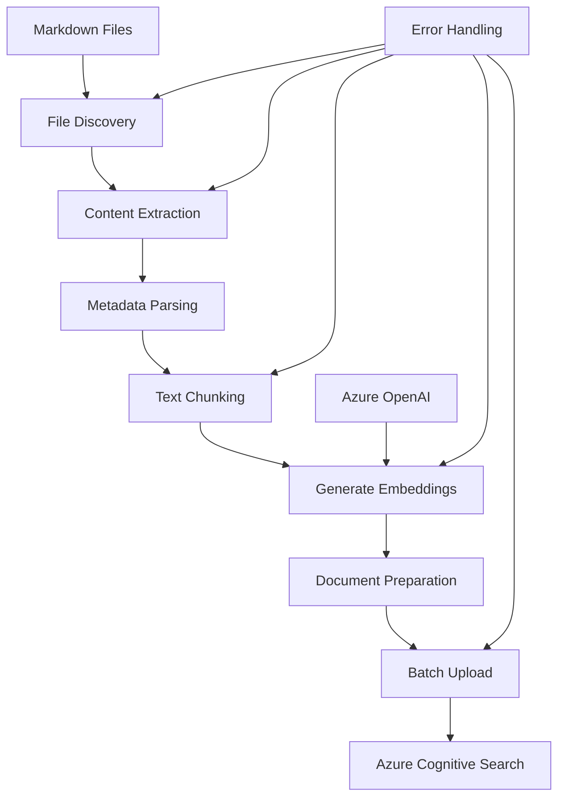

# Document Upload to Azure Cognitive Search - Complete Implementation Guide

## Overview

This guide covers uploading work item documentation to Azure Cognitive Search with vector embeddings.

**Directory Structure Expected:**

- Root folder: `"Work Items"` on desktop
- Organization: Each work item has its own subdirectory
- Directory names serve as work item identifiers
- Markdown files within each subdirectory contain the documentation

## Table of Contents

1. [Index Schema Design](#index-schema-design)
2. [Document Processing Pipeline](#document-processing-pipeline)
3. [Upload Implementation](#upload-implementation)
4. [Helper Modules](#helper-modules)
5. [Troubleshooting Guide](#troubleshooting-guide)

---

# Index Schema Design

## Azure Cognitive Search Index Schema

The following schema is optimized for work item document search with vector capabilities:

```json
{
  "name": "work-items-index",
  "fields": [
    {
      "name": "id",
      "type": "Edm.String",
      "key": true, // Document key - required, unique
      "searchable": false, // Not needed for full-text search
      "filterable": true, // Enables exact ID lookups
      "retrievable": true, // Return in results
      "sortable": false, // IDs rarely need sorting
      "facetable": false // IDs not useful for faceting
    },
    {
      "name": "content",
      "type": "Edm.String",
      "searchable": true, // Enable full-text search
      "filterable": false, // Large text not suitable for filtering
      "retrievable": true, // Show content in results
      "sortable": false, // Content too large to sort effectively
      "facetable": false, // Content not suitable for faceting
      "analyzer": "standard.lucene" // Standard text analysis
    },
    {
      "name": "content_vector",
      "type": "Collection(Edm.Single)",
      "searchable": true, // Required for vector search
      "filterable": false, // Vectors not filterable
      "retrievable": false, // Don't return raw vectors (save bandwidth)
      "stored": false, // Don't store extra copy (save storage)
      "sortable": false, // Vectors not sortable
      "facetable": false, // Vectors not facetable
      "dimensions": 1536, // text-embedding-ada-002 dimensions
      "vectorSearchProfile": "vector-profile" // Links to vector config
    },
    {
      "name": "file_path",
      "type": "Edm.String",
      "searchable": false, // File paths not for full-text search
      "filterable": true, // Filter by specific files/directories
      "retrievable": true, // Show source file in results
      "sortable": false, // Sorting by path rarely needed
      "facetable": true // Group results by directory/file type
    },
    {
      "name": "title",
      "type": "Edm.String",
      "searchable": true, // Titles are highly searchable
      "filterable": false, // Exact title filtering rare
      "retrievable": true, // Show title in results
      "sortable": false, // Title sorting not typically needed
      "facetable": false // Titles too varied for faceting
    },
    {
      "name": "work_item_id",
      "type": "Edm.String",
      "searchable": false, // IDs are exact-match only
      "filterable": true, // Filter by work item ID
      "retrievable": true, // Show work item ID in results
      "sortable": false, // ID sorting rarely useful
      "facetable": true // Group by work item
    },
    {
      "name": "tags",
      "type": "Collection(Edm.String)",
      "searchable": true, // Search within tags
      "filterable": true, // Filter by specific tags
      "retrievable": true, // Show tags in results
      "sortable": false, // Tag arrays not sortable
      "facetable": true, // Facet navigation by tags
      "analyzer": "standard.lucene" // Standard analyzer for tag text processing
    },
    {
      "name": "last_modified",
      "type": "Edm.DateTimeOffset",
      "searchable": false, // Dates not for text search
      "filterable": true, // Filter by date ranges
      "retrievable": true, // Show modification date
      "sortable": true, // Sort by recency
      "facetable": false // Date faceting complex, better as ranges
    },
    {
      "name": "chunk_index",
      "type": "Edm.Int32",
      "searchable": false, // Numbers not for text search
      "filterable": true, // Filter by chunk position
      "retrievable": true, // Show chunk order
      "sortable": true, // Sort chunks by position
      "facetable": false // Chunk numbers not useful for faceting
    }
  ],

  // Vector Search Configuration
  "vectorSearch": {
    "profiles": [
      {
        "name": "vector-profile",
        "algorithm": "hnsw-algorithm" // Reference to algorithm configuration
      }
    ],
    "algorithms": [
      {
        "name": "hnsw-algorithm",
        "kind": "hnsw", // HNSW algorithm type
        "hnswParameters": {
          "metric": "cosine", // Best for Azure OpenAI embeddings
          "m": 4, // Bi-directional links (4-10)
          "efConstruction": 400, // Index quality (100-1000)
          "efSearch": 500 // Search quality (100-1000)
        }
      }
    ]
  }
}
```

### ⚠️ Critical Schema Requirements

**IMPORTANT**: The `last_modified` field must be `Edm.DateTimeOffset` type. Convert timestamps to ISO format:

```python
from datetime import datetime
last_modified_iso = datetime.fromtimestamp(timestamp).isoformat() + 'Z'
```

**Tags Field Considerations:**

- Tags are automatically extracted from frontmatter, content hashtags, and work item IDs
- Each document will always have at least the work item ID as a tag for filtering
- Use lowercase tags for consistency (e.g., `["bug", "frontend", "wi-12345"]`)
- Tags support full-text search and faceting for navigation
- Maximum recommended tags per document: 20 (for performance)

### Schema Design Rationale

- **Document Key (`id`)**: Unique identifier for deduplication and updates
- **Content Fields**: Separate storage for human-readable content and vector embeddings
- **Metadata Fields**: Structured information for filtering and faceting
- **Tags Field**: Collection supports multiple sources (frontmatter, hashtags, work item IDs) with automatic extraction and normalization
- **Vector Configuration**: HNSW algorithm with cosine similarity for Azure OpenAI embeddings

---

# Document Processing Pipeline

This section provides practical implementation details for processing and uploading documents to Azure Cognitive Search.

## Architecture Overview



## Processing Stages Explained

### 1. **File Discovery and Reading**

- Recursively scan directories for markdown files
- Handle various file encodings and formats
- Extract frontmatter metadata when present
- Parse document structure and content

### 2. **Content Processing**

- Clean and normalize text content
- Extract meaningful metadata (titles, IDs, tags)
- Handle different markdown syntax variations
- Preserve important formatting context

### 3. **Text Chunking Strategy**

- Split large documents into searchable chunks
- Maintain semantic coherence within chunks
- Create overlapping segments for context preservation
- Optimize chunk sizes for embedding models

### 4. **Embedding Generation**

- Convert text chunks to vector embeddings
- Use Azure OpenAI text-embedding models
- Implement batch processing for efficiency
- Handle rate limiting and error scenarios

### 5. **Document Upload**

- Prepare documents in search index format
- Batch upload for optimal performance
- Implement retry logic for failed uploads
- Validate document structure and field mappings

### Step 1: File Discovery and Reading

```python
import os
from pathlib import Path
from typing import List, Dict, Optional
import frontmatter
import re

def discover_markdown_files(PERSONAL_DOCUMENTATION_ROOT_DIRECTORY: str) -> List[Path]:
    """Find all markdown files in the Work Items directory structure"""
    work_items_dir = Path(PERSONAL_DOCUMENTATION_ROOT_DIRECTORY)

    if not work_items_dir.exists():
        raise FileNotFoundError(f"Work Items directory does not exist: {PERSONAL_DOCUMENTATION_ROOT_DIRECTORY}")

    markdown_files = []

    # Iterate through each work item subdirectory
    for work_item_dir in work_items_dir.iterdir():
        if work_item_dir.is_dir():
            # Find all .md files in this work item directory
            work_item_md_files = list(work_item_dir.rglob("*.md"))

            # Filter out empty files and add to main list
            valid_files = [f for f in work_item_md_files if f.is_file() and f.stat().st_size > 0]
            markdown_files.extend(valid_files)

    return sorted(markdown_files)

def extract_metadata(content: str, file_path: Path) -> Dict:
    """Extract metadata from file content and directory structure"""
    try:
        # Parse frontmatter if present
        # Note: Frontmatter is YAML metadata at the top of markdown files,
        # enclosed between '---' markers (e.g., title, tags, date)
        post = frontmatter.loads(content)
        metadata = dict(post.metadata) if post.metadata else {}

        # Extract work item ID from directory name (this is the key change)
        work_item_dir = file_path.parent
        work_item_id = work_item_dir.name  # Directory name is the work item ID
        metadata['work_item_id'] = work_item_id

        # Extract title (priority: frontmatter > first heading > filename)
        if 'title' not in metadata:
            title_match = re.search(r'^#\s+(.+)$', content, re.MULTILINE)
            metadata['title'] = (
                title_match.group(1).strip() if title_match
                else file_path.stem.replace('_', ' ').replace('-', ' ')
            )

        # Extract tags from frontmatter or content
        if 'tags' not in metadata:
            tags = set()

            # From frontmatter
            if 'tags' in post.metadata:
                fm_tags = post.metadata['tags']
                if isinstance(fm_tags, list):
                    tags.update(str(tag).strip() for tag in fm_tags)
                elif isinstance(fm_tags, str):
                    tags.update(tag.strip() for tag in fm_tags.split(','))

            # From hashtags in content
            hashtags = re.findall(r'#(\w+)', content)
            tags.update(hashtags)

            # Add work item ID as a tag for easier searching
            tags.add(work_item_id)

            metadata['tags'] = sorted(list(tags)) if tags else [work_item_id]

        # File system metadata
        file_stat = file_path.stat()
        metadata['last_modified'] = file_stat.st_mtime
        metadata['work_item_directory'] = str(work_item_dir)

        return metadata

    except Exception as e:
        # Return minimal metadata on error, but always include work item ID
        work_item_id = file_path.parent.name
        return {
            'title': file_path.stem.replace('_', ' ').replace('-', ' '),
            'work_item_id': work_item_id,
            'last_modified': file_path.stat().st_mtime,
            'tags': [work_item_id],
            'work_item_directory': str(file_path.parent)
        }

def read_markdown_file(file_path: Path) -> Optional[Dict]:
    """Read and parse a markdown file"""
    try:
        # Read file content
        content = file_path.read_text(encoding='utf-8')

        if not content.strip():
            return None  # Skip empty files

        # Extract metadata
        metadata = extract_metadata(content, file_path)

        # Remove frontmatter from content
        post = frontmatter.loads(content)
        clean_content = post.content if post.metadata else content

        return {
            'content': clean_content.strip(),
            'file_path': str(file_path),
            'metadata': metadata
        }

    except Exception as e:
        print(f"Error reading {file_path}: {e}")
        return None
```

## Usage Example

````python
# Usage for Work Items directory structure
from pathlib import Path

def process_work_items_directory(PERSONAL_DOCUMENTATION_ROOT_DIRECTORY: str):
    """Process all markdown files in the Work Items directory structure"""

    # Discover files across all work item subdirectories
    files = discover_markdown_files(PERSONAL_DOCUMENTATION_ROOT_DIRECTORY)
    print(f"Found {len(files)} markdown files across work item directories")

    # Group files by work item for processing
    work_items = {}
    processed_files = []

    for file_path in files:
        file_data = read_markdown_file(file_path)
        if file_data:
            work_item_id = file_data['metadata']['work_item_id']

            # Group by work item ID
            if work_item_id not in work_items:
                work_items[work_item_id] = []
            work_items[work_item_id].append(file_data)

            processed_files.append(file_data)
            print(f"Processed: {file_data['metadata']['title']} (Work Item: {work_item_id})")

    print(f"\nSummary:")
    print(f"- Total files processed: {len(processed_files)}")
    print(f"- Unique work items: {len(work_items)}")

    for work_item_id, files in work_items.items():
        print(f"  - {work_item_id}: {len(files)} files")

    return processed_files

# Example usage - point to your desktop Work Items folder
PERSONAL_DOCUMENTATION_ROOT_DIRECTORY = r"C:\Users\YourUsername\Desktop\Work Items"
documents = process_work_items_directory(PERSONAL_DOCUMENTATION_ROOT_DIRECTORY)
```### Step 2: Simple Text Chunking

```python
import re

def simple_chunk_text(content: str, max_chunk_size: int = 4000, overlap: int = 200) -> List[str]:
    """Split text into chunks with simple sentence-based splitting"""

    # Split by paragraphs first
    paragraphs = [p.strip() for p in content.split('\n\n') if p.strip()]

    chunks = []
    current_chunk = ""

    for paragraph in paragraphs:
        # If paragraph is too long, split by sentences
        if len(paragraph) > max_chunk_size:
            sentences = re.split(r'(?<=[.!?])\s+', paragraph)

            for sentence in sentences:
                if len(current_chunk) + len(sentence) > max_chunk_size:
                    if current_chunk:
                        chunks.append(current_chunk.strip())
                        # Create overlap with last few words
                        overlap_text = ' '.join(current_chunk.split()[-20:]) if current_chunk else ""
                        current_chunk = overlap_text + " " + sentence if overlap_text else sentence
                    else:
                        current_chunk = sentence
                else:
                    current_chunk = current_chunk + " " + sentence if current_chunk else sentence
        else:
            # Check if adding this paragraph exceeds limit
            if len(current_chunk) + len(paragraph) > max_chunk_size:
                if current_chunk:
                    chunks.append(current_chunk.strip())
                    # Create overlap
                    overlap_text = ' '.join(current_chunk.split()[-20:]) if current_chunk else ""
                    current_chunk = overlap_text + "\n\n" + paragraph if overlap_text else paragraph
                else:
                    current_chunk = paragraph
            else:
                current_chunk = current_chunk + "\n\n" + paragraph if current_chunk else paragraph

    # Add final chunk
    if current_chunk.strip():
        chunks.append(current_chunk.strip())

    # Return all chunks without filtering by length
    return chunks

def process_document_chunks(file_data: Dict) -> List[str]:
    """Process a document and return text chunks"""
    content = file_data['content']
    return simple_chunk_text(content)
````

            # Start new chunk with overlap and current sentence
            current_chunk = overlap_buffer + " " + sentence if overlap_buffer else sentence

    # Add the last chunk
    if current_chunk:
        chunks.append(current_chunk.strip())

    # Filter out very short chunks
    chunks = [chunk for chunk in chunks if len(chunk.strip()) > 50]

    return chunks

````

### Step 3: Generate Embeddings

```python
from openai import AzureOpenAI
from typing import List
import asyncio
import time

class EmbeddingGenerator:
    def __init__(self, client: AzureOpenAI, deployment_name: str):
        self.client = client
        self.deployment_name = deployment_name

    async def generate_embeddings_batch(self, texts: List[str], batch_size: int = 16) -> List[List[float]]:
        """Generate embeddings for text chunks in batches with rate limiting"""
        all_embeddings = []

        for i in range(0, len(texts), batch_size):
            batch = texts[i:i + batch_size]

            try:
                # Add delay to respect rate limits
                if i > 0:
                    await asyncio.sleep(1)  # 1 second between batches

                response = self.client.embeddings.create(
                    input=batch,
                    model=self.deployment_name  # Use your deployment name
                )

                batch_embeddings = [data.embedding for data in response.data]
                all_embeddings.extend(batch_embeddings)

                print(f"Generated embeddings for batch {i//batch_size + 1}/{(len(texts) + batch_size - 1)//batch_size}")

            except Exception as e:
                print(f"Error generating embeddings for batch {i//batch_size + 1}: {e}")
                # Add empty embeddings for failed batch to maintain alignment
                empty_embedding = [0.0] * 1536  # Dimension for text-embedding-ada-002
                all_embeddings.extend([empty_embedding] * len(batch))

        return all_embeddings
```

---

# Upload Implementation

## Simple Upload Function

```python
from azure.search.documents import SearchClient
from azure.core.credentials import AzureKeyCredential
from pathlib import Path
import time

def upload_to_search(documents, service_name, admin_key, index_name):
    """Upload processed documents to Azure Cognitive Search"""

    # Initialize search client
    search_client = SearchClient(
        endpoint=f"https://{service_name}.search.windows.net",
        index_name=index_name,
        credential=AzureKeyCredential(admin_key)
    )

    # Prepare documents for upload
    search_documents = []

    for doc in documents:
        for i, (chunk, embedding) in enumerate(zip(doc['chunks'], doc['embeddings'])):
            file_name = Path(doc['file_path']).stem
            doc_id = f"{file_name}_chunk_{i}".replace(" ", "_")

            search_doc = {
                'id': doc_id,
                'content': chunk,
                'content_vector': embedding,
                'file_path': doc['file_path'],
                'title': doc['metadata'].get('title', ''),
                'work_item_id': doc['metadata'].get('work_item_id', ''),
                'tags': doc['metadata'].get('tags', []),
                'last_modified': doc['metadata'].get('last_modified'),
                'chunk_index': i
            }
            search_documents.append(search_doc)

    # Upload documents
    try:
        result = search_client.upload_documents(documents=search_documents)
        print(f"Uploaded {len(search_documents)} documents")
        return True
    except Exception as e:
        print(f"Upload failed: {e}")
        return False
```

## Complete Processing Script

```python
import os
import asyncio
from pathlib import Path
from openai import AzureOpenAI

async def main():
    """Main processing function for Work Items directory structure"""

    # Configuration - set these in your environment
    PERSONAL_DOCUMENTATION_ROOT_DIRECTORY = os.getenv('PERSONAL_DOCUMENTATION_ROOT_DIRECTORY', r"C:\Users\YourUsername\Desktop\Work Items")
    azure_openai_endpoint = os.getenv('AZURE_OPENAI_ENDPOINT')
    azure_openai_key = os.getenv('AZURE_OPENAI_KEY')
    embedding_deployment = os.getenv('EMBEDDING_DEPLOYMENT', 'text-embedding-ada-002')
    search_service_name = os.getenv('AZURE_SEARCH_SERVICE')
    search_admin_key = os.getenv('AZURE_SEARCH_KEY')
    search_index_name = os.getenv('AZURE_SEARCH_INDEX', 'work-items-index')

    # Initialize file tracker for idempotent processing
    from src.file_tracker import ProcessingTracker
    tracker = ProcessingTracker("processed_files.json")

    print(f"File Tracker Stats: {tracker.get_stats()}")

    # Initialize Azure OpenAI client
    openai_client = AzureOpenAI(
        azure_endpoint=azure_openai_endpoint,
        api_key=azure_openai_key,
        api_version="2024-07-01"
    )

    # Process documents from Work Items directory structure
    markdown_files = discover_markdown_files(PERSONAL_DOCUMENTATION_ROOT_DIRECTORY)
    print(f"Found {len(markdown_files)} markdown files across work item directories")

    all_documents = []
    work_items_summary = {}

    for file_path in markdown_files:
        try:
            # Check if file needs processing (idempotent processing)
            if tracker.is_processed(file_path):
                print(f"⏭️  Skipping unchanged file: {file_path.name}")
                continue

            # Read and parse file
            file_data = read_markdown_file(file_path)
            if not file_data:
                continue

            work_item_id = file_data['metadata']['work_item_id']

            # Track work items for summary
            if work_item_id not in work_items_summary:
                work_items_summary[work_item_id] = 0
            work_items_summary[work_item_id] += 1

            # Create chunks
            chunks = process_document_chunks(file_data)

            # Generate embeddings using the EmbeddingGenerator class
            embedding_generator = EmbeddingGenerator(openai_client, embedding_deployment)
            embeddings = await embedding_generator.generate_embeddings_batch(chunks)

            all_documents.append({
                'file_path': str(file_path),
                'metadata': file_data['metadata'],
                'chunks': chunks,
                'embeddings': embeddings
            })

            # Mark file as processed after successful processing
            tracker.mark_processed(file_path)
            print(f"✅ Processed: {file_data['metadata']['title']} (Work Item: {work_item_id})")

        except Exception as e:
            print(f"❌ Error processing {file_path}: {e}")

    # Save tracking data after processing
    tracker.save()

    # Print summary
    print(f"\nProcessing Summary:")
    print(f"- Total files processed: {len(all_documents)}")
    print(f"- Files skipped (unchanged): {len(markdown_files) - len(all_documents)}")
    print(f"- Unique work items: {len(work_items_summary)}")
    for work_item_id, file_count in work_items_summary.items():
        print(f"  - {work_item_id}: {file_count} files")

    # Upload to Azure Cognitive Search
    success = upload_to_search(
        all_documents, search_service_name, search_admin_key, search_index_name
    )

    if success:
        total_chunks = sum(len(doc['chunks']) for doc in all_documents)
        print(f"Successfully uploaded {total_chunks} chunks from {len(all_documents)} files")
        print(f"Documents are now searchable by work item ID and content")

if __name__ == "__main__":
    asyncio.run(main())
```

## Environment Setup

Create a `.env` file with your configuration:

```bash
# Path to Work Items directory on desktop
PERSONAL_DOCUMENTATION_ROOT_DIRECTORY=C:\Users\YourUsername\Desktop\Work Items

# Azure OpenAI Configuration
AZURE_OPENAI_ENDPOINT=https://your-openai.openai.azure.com/
AZURE_OPENAI_KEY=your-openai-key
EMBEDDING_DEPLOYMENT=text-embedding-ada-002

# Azure Cognitive Search Configuration
AZURE_SEARCH_SERVICE=your-search-service
AZURE_SEARCH_KEY=your-search-admin-key
AZURE_SEARCH_INDEX=work-items-index
```

**Important Notes:**
- Update `PERSONAL_DOCUMENTATION_ROOT_DIRECTORY` to point to your actual "Work Items" folder on desktop
- Each subdirectory in "Work Items" should be named with the work item identifier
- Only `.md` files will be processed; other files in the directories will be ignored

---

# Helper Modules

## src/file_tracker.py - Idempotent Processing

**Purpose:** Ensures no file is processed more than once unless it has been modified, preventing unnecessary reprocessing and API costs.

**How it works:**
1. **File Signatures:** Creates unique fingerprints using file path, size, and modification timestamp
2. **Persistent Tracking:** Stores processed file signatures in `processed_files.json`
3. **Change Detection:** Compares current file signature with stored signature to detect changes
4. **Skip Unchanged:** Only processes files that are new or have been modified since last run

**Implementation:**
- Uses MD5 hash of `"filepath:filesize:modification_time"` as signature
- Automatically creates/updates tracking file on each run
- Gracefully handles missing or corrupted tracking files
- Provides statistics about processing state

```python
"""
File Processing Tracker
======================

Handles idempotent file processing by tracking file signatures and processing state.
Prevents reprocessing of unchanged files across multiple runs.
"""

import json
import hashlib
from pathlib import Path
from typing import Set, Dict, Any

def get_file_signature(file_path: Path) -> str:
    """Generate a signature for a file based on path, size, and modification time"""
    try:
        stat = file_path.stat()
        signature_data = f"{file_path}:{stat.st_size}:{stat.st_mtime}"
        return hashlib.md5(signature_data.encode()).hexdigest()
    except Exception:
        # Fallback to just the path if we can't get file stats
        return hashlib.md5(str(file_path).encode()).hexdigest()

class ProcessingTracker:
    """Track which files have been processed to avoid reprocessing"""

    def __init__(self, tracking_file: str = "processed_files.json"):
        self.tracking_file = Path(tracking_file)
        self.processed_signatures: Set[str] = set()
        self.file_mappings: Dict[str, str] = {}  # path -> signature
        self._load()

    def _load(self):
        """Load processed file signatures from tracking file"""
        if self.tracking_file.exists():
            try:
                with open(self.tracking_file, 'r', encoding='utf-8') as f:
                    data = json.load(f)
                    self.processed_signatures = set(data.get('signatures', []))
                    self.file_mappings = data.get('file_mappings', {})
            except Exception as e:
                print(f"Warning: Could not load tracking file: {e}")

    def save(self):
        """Save processed file signatures to tracking file"""
        try:
            data = {
                'signatures': list(self.processed_signatures),
                'file_mappings': self.file_mappings
            }
            with open(self.tracking_file, 'w', encoding='utf-8') as f:
                json.dump(data, f, indent=2)
        except Exception as e:
            print(f"Warning: Could not save tracking file: {e}")

    def is_processed(self, file_path: Path) -> bool:
        """Check if a file has been processed (unchanged since last processing)"""
        current_signature = get_file_signature(file_path)
        return current_signature in self.processed_signatures

    def mark_processed(self, file_path: Path):
        """Mark a file as processed"""
        signature = get_file_signature(file_path)
        self.processed_signatures.add(signature)
        self.file_mappings[str(file_path)] = signature

    def get_stats(self) -> Dict[str, Any]:
        """Get statistics about processed files"""
        return {
            'total_processed': len(self.processed_signatures),
            'tracking_file_exists': self.tracking_file.exists(),
            'tracking_file_path': str(self.tracking_file.absolute())
        }

    def clear(self):
        """Clear all tracking data"""
        self.processed_signatures.clear()
        self.file_mappings.clear()
        if self.tracking_file.exists():
            self.tracking_file.unlink()
```

## src/document_utils.py - Document Processing Utilities

```python
"""
Document Processing Utilities
============================

Utility functions for processing markdown documents including file discovery,
metadata extraction, and text chunking.
"""

import re
import frontmatter
from pathlib import Path
from typing import List, Dict, Optional

def discover_markdown_files(PERSONAL_DOCUMENTATION_ROOT_DIRECTORY: str) -> List[Path]:
    """
    Find all markdown files in the Work Items directory structure.

    Args:
        PERSONAL_DOCUMENTATION_ROOT_DIRECTORY: Path to the Work Items directory

    Returns:
        List[Path]: Sorted list of valid markdown file paths

    Raises:
        FileNotFoundError: If the Work Items directory doesn't exist
    """
    work_items_dir = Path(PERSONAL_DOCUMENTATION_ROOT_DIRECTORY)

    if not work_items_dir.exists():
        raise FileNotFoundError(f"Work Items directory does not exist: {PERSONAL_DOCUMENTATION_ROOT_DIRECTORY}")

    markdown_files = []

    # Iterate through each work item subdirectory
    for work_item_dir in work_items_dir.iterdir():
        if work_item_dir.is_dir():
            # Find all .md files in this work item directory
            work_item_md_files = list(work_item_dir.rglob("*.md"))

            # Filter out empty files and add to main list
            valid_files = [f for f in work_item_md_files if f.is_file() and f.stat().st_size > 0]
            markdown_files.extend(valid_files)

    return sorted(markdown_files)

def extract_metadata(content: str, file_path: Path) -> Dict:
    """
    Extract metadata from file content and directory structure.

    Extracts information from:
    - YAML frontmatter (title, tags, etc.)
    - First heading in content
    - Directory structure (work item ID)
    - File system metadata

    Args:
        content: Raw file content
        file_path: Path to the file

    Returns:
        Dict: Extracted metadata including title, work_item_id, tags, last_modified
    """
    try:
        # Parse frontmatter if present
        post = frontmatter.loads(content)
        metadata = dict(post.metadata) if post.metadata else {}

        # Extract work item ID from directory name
        work_item_dir = file_path.parent
        work_item_id = work_item_dir.name  # Directory name is the work item ID
        metadata['work_item_id'] = work_item_id

        # Extract title (priority: frontmatter > first heading > filename)
        if 'title' not in metadata:
            title_match = re.search(r'^#\s+(.+)$', content, re.MULTILINE)
            metadata['title'] = (
                title_match.group(1).strip() if title_match
                else file_path.stem.replace('_', ' ').replace('-', ' ')
            )

        # Extract tags from frontmatter or content
        if 'tags' not in metadata:
            tags = set()

            # From frontmatter
            if 'tags' in post.metadata:
                fm_tags = post.metadata['tags']
                if isinstance(fm_tags, list):
                    tags.update(str(tag).strip() for tag in fm_tags)
                elif isinstance(fm_tags, str):
                    tags.update(tag.strip() for tag in fm_tags.split(','))

            # From hashtags in content
            hashtags = re.findall(r'#(\w+)', content)
            tags.update(hashtags)

            # Add work item ID as a tag for easier searching
            tags.add(work_item_id)

            metadata['tags'] = sorted(list(tags)) if tags else [work_item_id]

        # File system metadata
        file_stat = file_path.stat()
        metadata['last_modified'] = file_stat.st_mtime
        metadata['work_item_directory'] = str(work_item_dir)

        return metadata

    except Exception as e:
        # Return minimal metadata on error, but always include work item ID
        work_item_id = file_path.parent.name
        return {
            'title': file_path.stem.replace('_', ' ').replace('-', ' '),
            'work_item_id': work_item_id,
            'last_modified': file_path.stat().st_mtime,
            'tags': [work_item_id],
            'work_item_directory': str(file_path.parent)
        }

def read_markdown_file(file_path: Path) -> Optional[Dict]:
    """
    Read and parse a markdown file.

    Args:
        file_path: Path to the markdown file

    Returns:
        Dict with 'content', 'file_path', 'metadata' keys, or None if failed
    """
    try:
        # Read file content
        content = file_path.read_text(encoding='utf-8')

        if not content.strip():
            return None  # Skip empty files

        # Extract metadata
        metadata = extract_metadata(content, file_path)

        # Remove frontmatter from content
        post = frontmatter.loads(content)
        clean_content = post.content if post.metadata else content

        return {
            'content': clean_content.strip(),
            'file_path': str(file_path),
            'metadata': metadata
        }

    except Exception as e:
        print(f"Error reading {file_path}: {e}")
        return None

def simple_chunk_text(content: str, max_chunk_size: int = 4000, overlap: int = 200) -> List[str]:
    """
    Split text into chunks with simple sentence-based splitting.

    Args:
        content: Text content to chunk
        max_chunk_size: Maximum characters per chunk
        overlap: Characters to overlap between chunks

    Returns:
        List[str]: Text chunks
    """
    # Split by paragraphs first
    paragraphs = [p.strip() for p in content.split('\n\n') if p.strip()]

    chunks = []
    current_chunk = ""

    for paragraph in paragraphs:
        # If paragraph is too long, split by sentences
        if len(paragraph) > max_chunk_size:
            sentences = re.split(r'(?<=[.!?])\s+', paragraph)

            for sentence in sentences:
                if len(current_chunk) + len(sentence) > max_chunk_size:
                    if current_chunk:
                        chunks.append(current_chunk.strip())
                        # Create overlap with last few words
                        overlap_text = ' '.join(current_chunk.split()[-20:]) if current_chunk else ""
                        current_chunk = overlap_text + " " + sentence if overlap_text else sentence
                    else:
                        current_chunk = sentence
                else:
                    current_chunk = current_chunk + " " + sentence if current_chunk else sentence
        else:
            # Check if adding this paragraph exceeds limit
            if len(current_chunk) + len(paragraph) > max_chunk_size:
                if current_chunk:
                    chunks.append(current_chunk.strip())
                    # Create overlap
                    overlap_text = ' '.join(current_chunk.split()[-20:]) if current_chunk else ""
                    current_chunk = overlap_text + "\n\n" + paragraph if overlap_text else paragraph
                else:
                    current_chunk = paragraph
            else:
                current_chunk = current_chunk + "\n\n" + paragraph if current_chunk else paragraph

    # Add final chunk
    if current_chunk.strip():
        chunks.append(current_chunk.strip())

    # Return all chunks without filtering by length
    return chunks

def process_document_chunks(file_data: Dict) -> List[str]:
    """
    Process a document and return text chunks.

    Args:
        file_data: Dictionary with 'content' key

    Returns:
        List[str]: Text chunks ready for embedding generation
    """
    content = file_data['content']
    return simple_chunk_text(content)
```

---

# Troubleshooting Guide

## Common Issues and Solutions

### 1. Timestamp Format Error

**Error:**
```
Cannot convert the literal '1754470054.545506' to the expected type 'Edm.DateTimeOffset'
```

**Solution:** Always convert timestamps to ISO format:
```python
from datetime import datetime

last_modified_timestamp = document['metadata'].get('last_modified')
if last_modified_timestamp:
    last_modified_iso = datetime.fromtimestamp(last_modified_timestamp).isoformat() + 'Z'
```

### 2. Embedding Dimension Mismatch

**Error:** Vector field expects 1536 dimensions but received different size.

**Solution:** Validate embeddings before upload:
```python
if embedding and isinstance(embedding, list) and len(embedding) == 1536:
    clean_embedding = [float(x) if x is not None else 0.0 for x in embedding]
    search_doc['content_vector'] = clean_embedding
```

### 3. Rate Limiting Issues

**Error:** Too many requests to OpenAI service.

**Solution:** Implement proper rate limiting:
```python
# Add delays between batches
if i > 0:
    await asyncio.sleep(1)  # 1 second between batches

# Use smaller batch sizes
batch_size = 16  # Reduce if still hitting limits
```

### 4. Index Schema Mismatch

**Error:** Field not found or wrong type.

**Solution:** Run schema validation test:
```bash
# Check Azure Search service health in Azure Portal
# Verify index schema matches expected fields
```

### 5. Connection Issues

**Symptoms:** Timeouts, authentication errors.

**Diagnostic steps:**
1. Check environment variables in `.env` file
2. Verify service endpoints and keys
3. Check network connectivity to Azure services

### 6. File Processing Issues

**Common causes:**
- Empty or corrupted files
- Encoding issues (non-UTF-8)
- Missing frontmatter
- Invalid YAML in frontmatter

**Solution:** The helpers include robust error handling and fallback mechanisms.

### 7. Document Upload Failures

**Diagnostic commands:**
```bash
# Check Azure Search service health in Azure Portal
# Upload a single test file to isolate issues
# Review error logs and service status
```

## Validation Checklist

Before running full document upload:

- [ ] `.env` file configured with all required values
- [ ] Azure Search index created with correct schema
- [ ] Azure OpenAI service accessible and configured
- [ ] Network connectivity to Azure services verified

## Performance Optimization

### For Large Document Sets

1. **Use idempotent processing with FileTracker:**
   ```python
   tracker = ProcessingTracker("processed_files.json")
   # Only processes changed files, saving time and API costs
   # Automatically skips files that haven't been modified
   # Tracks processing state across multiple runs
   ```

   **Benefits:**
   - **Cost Savings:** Avoids regenerating embeddings for unchanged files
   - **Time Efficiency:** Skips processing for unmodified documents
   - **Reliability:** Resumes from where it left off if interrupted
   - **Automatic Detection:** Uses file modification time and size for change detection

2. **Implement batch processing:**
   ```python
   batch_size = 16  # Adjust based on rate limits
   await asyncio.sleep(1)  # Between batches
   ```

3. **Monitor rate limits:**
   - Azure OpenAI: Check quota and TPM limits
   - Azure Search: Monitor request units
   - Implement exponential backoff for retries

4. **Use parallel processing carefully:**
   ```python
   # Process files individually to avoid overwhelming services
   for file_path in files_to_process:
       # Process one at a time with delays
       await asyncio.sleep(2)
   ```

---

## Project Structure

```
WorkItemDocumentationRetriever/
├── src/
│   ├── document_upload.py       # Main orchestration module
│   ├── document_utils.py        # Document processing utilities
│   ├── file_tracker.py          # Idempotent processing tracker
│   └── openai_service.py        # OpenAI service wrapper
├── scripts/
│   ├── upload_single_file.py     # Simple single file upload
│   └── create_sample_file.py     # Create test files
├── docs/
│   └── 03-DocumentUpload.md      # This document
└── .env                          # Environment configuration
```

**Configuration Notes:**
- Update `PERSONAL_DOCUMENTATION_ROOT_DIRECTORY` to point to your actual "Work Items" folder
- Each subdirectory should be named with the work item identifier
- Only `.md` files will be processed
````
