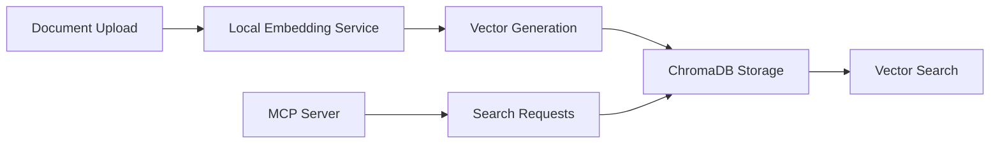
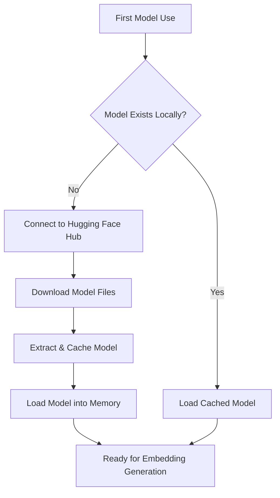

# Local Embedding Service Documentation

## Free Alternative for ChromaDB Migration

### Overview

The Local Embedding Service provides a **completely free, offline-capable** alternative to cloud-based embedding APIs (Azure OpenAI, OpenAI) for the ChromaDB migration. This service is essential for users who:

- 🚫 Don't have access to paid embedding APIs
- 💰 Want to avoid per-token costs
- 🔒 Need offline/private document processing
- ⚡ Want faster embedding generation without API rate limits
- 🏠 Prefer local-first solutions

---

## Why Local Embeddings are Needed

### The Problem

ChromaDB requires vector embeddings to store and search documents effectively. Previously, the system relied on:

- **Azure OpenAI Embeddings** - Requires active Azure subscription with credits
- **OpenAI API** - Pay-per-token pricing model
- **Internet Connection** - Always required for API calls

### The Solution

Local Embedding Service using **Sentence Transformers** provides:

- **Zero Cost** - No API fees or subscription required
- **Offline Operation** - Works without internet after initial model download
- **Privacy** - Documents never leave your machine
- **Speed** - No network latency or rate limits
- **Reliability** - No API downtime or quota issues

---

## Technical Architecture

### Core Components

```
Local Embedding Service
├── LocalEmbeddingGenerator (Primary Service)
├── EmbeddingServiceFactory (Provider Selection)
└── Multiple Model Options (Different Use Cases)
```

### Integration Points



---

## Available Models

### 🚀 Fast Model (Recommended)

- **Model**: `all-MiniLM-L6-v2`
- **Dimensions**: 384
- **Size**: ~90MB
- **Speed**: Fastest
- **Use Case**: General purpose, good balance of speed and quality

### 🎯 Quality Model

- **Model**: `all-mpnet-base-v2`
- **Dimensions**: 768
- **Size**: ~438MB
- **Speed**: Slower but higher quality
- **Use Case**: When embedding quality is more important than speed

### ❓ QA Optimized Model

- **Model**: `multi-qa-MiniLM-L6-cos-v1`
- **Dimensions**: 384
- **Size**: ~90MB
- **Speed**: Fast
- **Use Case**: Question-answering scenarios, semantic search

---

## Configuration

### Environment Variables

```bash
# Use local embeddings (default when no API keys present)
EMBEDDING_PROVIDER=local

# Select model quality
LOCAL_EMBEDDING_MODEL=fast          # all-MiniLM-L6-v2
LOCAL_EMBEDDING_MODEL=quality       # all-mpnet-base-v2
LOCAL_EMBEDDING_MODEL=qa           # multi-qa-MiniLM-L6-cos-v1
```

### Auto-Detection Logic

The system automatically detects the best available embedding provider:

1. **Check for OpenAI API Key** → Use OpenAI if available
2. **Check for Azure OpenAI Credentials** → Use Azure if available
3. **Fallback to Local** → Always works (after model download)

---

## Installation & Setup

### Prerequisites

```bash
pip install sentence-transformers torch transformers numpy
```

### First-Time Model Download

Models are automatically downloaded on first use:

```python
# This will download the model (~90MB for fast model)
from src.common.embedding_services.local_embedding_service import LocalEmbeddingGenerator
generator = LocalEmbeddingGenerator(model_name='all-MiniLM-L6-v2')
```

### Storage Location

Models are cached locally in:

- **Windows**: `C:\\Users\\{username}\\.cache\\huggingface\\transformers\\`
- **Linux/Mac**: `~/.cache/huggingface/transformers/`

---

## Model Download Process & Execution

### How Models are Downloaded

The local embedding service uses the **Hugging Face Hub** to automatically download pre-trained models:

#### Download Flow



#### What Gets Downloaded

For each model, the following files are downloaded:

**Model Files:**

- `pytorch_model.bin` - Main model weights (largest file)
- `config.json` - Model configuration
- `tokenizer.json` - Text tokenization rules
- `tokenizer_config.json` - Tokenizer configuration
- `vocab.txt` - Vocabulary mappings
- `special_tokens_map.json` - Special token definitions

**Example Download for `all-MiniLM-L6-v2`:**

```
📦 all-MiniLM-L6-v2/
├── pytorch_model.bin (90.9 MB) ⭐ Main model
├── config.json (612 bytes)
├── tokenizer.json (466 KB)
├── tokenizer_config.json (350 bytes)
├── vocab.txt (232 KB)
└── special_tokens_map.json (112 bytes)
```

#### Download Progress

You'll see download progress in the console:

```
Downloading: 100%|██████████| 90.9M/90.9M [00:15<00:00, 6.10MB/s]
Downloading: 100%|██████████| 612/612 [00:00<00:00, 123kB/s]
Downloading: 100%|██████████| 466k/466k [00:00<00:00, 2.34MB/s]
```

### Model Loading & Runtime

#### Initialization Process

```python
# Step 1: Import and Initialize
from src.common.embedding_services.local_embedding_service import LocalEmbeddingGenerator

# Step 2: Model Loading (happens automatically)
generator = LocalEmbeddingGenerator(model_name='all-MiniLM-L6-v2')

# What happens internally:
# 1. Check if model exists in cache
# 2. Download if needed (first time only)
# 3. Load model into PyTorch
# 4. Initialize tokenizer
# 5. Set up embedding pipeline
```

#### Memory Loading

When a model is first used:

```
🔄 Loading model 'all-MiniLM-L6-v2'...
📁 Using cache: C:\Users\{user}\.cache\huggingface\transformers\
⚡ Model loaded successfully (384 dimensions)
🧠 Memory usage: ~200MB
✅ Ready for embedding generation
```

### Runtime Execution Process

#### Single Document Embedding

```python
# Input text processing flow
text = "Machine learning is fascinating"

# 1. Text Tokenization
tokens = tokenizer.encode(text, max_length=512, truncation=True)
# Output: [101, 3344, 4083, 2003, 17616, 102, ...]

# 2. Model Forward Pass
with torch.no_grad():
    outputs = model(input_ids=tokens)
    embeddings = outputs.last_hidden_state

# 3. Pooling Strategy (mean pooling)
attention_mask = torch.ones_like(tokens)
masked_embeddings = embeddings * attention_mask.unsqueeze(-1)
pooled = masked_embeddings.sum(dim=1) / attention_mask.sum(dim=1, keepdim=True)

# 4. Normalization
normalized_embedding = F.normalize(pooled, p=2, dim=1)

# Final output: [0.1234, -0.5678, 0.9012, ...] (384 dimensions)
```

#### Batch Processing Execution

For multiple documents, the service uses efficient batch processing:

```python
# Batch processing for multiple documents
texts = [
    "Document 1 content...",
    "Document 2 content...",
    "Document 3 content..."
]

# 1. Batch Tokenization (parallel)
batch_tokens = [tokenizer.encode(text) for text in texts]

# 2. Padding to same length
max_length = max(len(tokens) for tokens in batch_tokens)
padded_batch = torch.stack([
    F.pad(tokens, (0, max_length - len(tokens)))
    for tokens in batch_tokens
])

# 3. Single model forward pass (efficient)
with torch.no_grad():
    batch_outputs = model(padded_batch)

# 4. Extract embeddings for each document
embeddings = [output.numpy() for output in batch_outputs]
```

### Execution Performance

#### Cold Start vs Warm Start

**Cold Start (First Use):**

```
⏱️  Model Download: 15-30 seconds (depending on internet)
🧠 Model Loading: 2-5 seconds
🚀 First Embedding: 0.1-0.3 seconds
💾 Memory Usage: Model loaded into RAM
```

**Warm Start (Subsequent Uses):**

```
🧠 Model Loading: 2-5 seconds (from cache)
⚡ Embeddings: 0.01-0.1 seconds per document
💨 Batch Processing: ~0.001 seconds per document
```

#### CPU Execution

**CPU Processing (Default):**

- Uses all available CPU cores for parallel processing
- Memory efficient with automatic optimization
- Suitable for all workloads and document sizes
- No special hardware requirements
- Fast performance for typical embedding tasks

### Optimization Features

#### Smart Caching

- **Model Persistence**: Once loaded, models stay in memory
- **Tokenizer Reuse**: Tokenizer instances are cached
- **Batch Optimization**: Automatic batching for multiple documents

#### Memory Management

- **Lazy Loading**: Models only loaded when first used
- **Garbage Collection**: Automatic cleanup of intermediate tensors
- **Memory Monitoring**: Track usage and optimize batch sizes

#### Performance Tuning

```python
# Available optimizations (handled automatically)
- Mixed precision (FP16) on compatible hardware
- Dynamic batching based on available memory
- Parallel tokenization for large batches
- Efficient attention computation
```

---

## Performance Characteristics

### Speed Comparison (3 documents, ~100 words each)

| Provider        | Time  | Cost     | Requires Internet   |
| --------------- | ----- | -------- | ------------------- |
| Local (Fast)    | ~0.1s | $0       | No (after download) |
| Local (Quality) | ~0.3s | $0       | No (after download) |
| OpenAI API      | ~1-2s | ~$0.0001 | Yes                 |
| Azure OpenAI    | ~1-2s | ~$0.0001 | Yes                 |

### Memory Usage

- **Fast Model**: ~200MB RAM
- **Quality Model**: ~800MB RAM
- **QA Model**: ~200MB RAM

---

## ChromaDB Integration

### Automatic Integration

The ChromaDB service automatically uses local embeddings when configured:

```python
# ChromaDB automatically detects local embedding provider
os.environ['EMBEDDING_PROVIDER'] = 'local'
chromadb_service = ChromaDBService(collection_name="my_documents")

# Documents are embedded locally before storage
documents = [{"id": "doc1", "content": "Sample text", ...}]
success_count, failed_count = chromadb_service.upload_search_objects_batch(documents)
```

### Vector Search

Search queries are also embedded locally for consistency:

```python
# Query embedding uses same local model
results = await chromadb_service.vector_search(
    query="Find documents about machine learning",
    top=5
)
```

---

## Migration Benefits

### For ChromaDB Migration

1. **Cost Elimination**

   - No per-token charges for embedding generation
   - No monthly API subscription fees
   - Unlimited document processing

2. **Performance Improvements**

   - No network latency
   - No rate limiting
   - Batch processing optimization
   - Faster document upload pipelines

3. **Privacy & Security**

   - Documents never sent to external APIs
   - No data logging by third parties
   - Complete control over sensitive content

4. **Reliability**
   - No API outages or downtime
   - No quota limitations
   - No dependency on external services

---

## Use Cases

### Ideal Scenarios for Local Embeddings

✅ **Personal Documentation Systems**

- Work item documentation
- Personal knowledge bases
- Private document collections

✅ **Development & Testing**

- Local development environments
- CI/CD pipelines
- Automated testing

✅ **Sensitive Content**

- Confidential business documents
- Legal documents
- Medical records

✅ **High-Volume Processing**

- Large document collections
- Batch processing jobs
- Real-time embedding generation

### When to Use Cloud APIs

🌐 **Use OpenAI/Azure when:**

- Need cutting-edge embedding quality
- Processing very specialized content
- Have existing API credits
- Need specific model capabilities

---

## Troubleshooting

### Common Issues

#### Model Download Fails

```bash
# Solution: Check internet connection and retry
# Models are downloaded from Hugging Face Hub
```

#### Out of Memory Error

```python
# Solution: Use fast model instead of quality model
LOCAL_EMBEDDING_MODEL=fast  # Uses less RAM
```

#### Slow Performance

```python
# Solutions:
# 1. Use fast model for better performance
LOCAL_EMBEDDING_MODEL=fast

# 2. Batch processing (already implemented)
# 3. Ensure sufficient RAM is available
```

### Testing Local Embeddings

```bash
# Run comprehensive test suite
python test_local_embedding_service.py

# Test specific model
python -c "
import asyncio
from src.common.embedding_services.local_embedding_service import LocalEmbeddingGenerator

async def test():
    gen = LocalEmbeddingGenerator('all-MiniLM-L6-v2')
    emb = await gen.generate_embedding('test text')
    print(f'Success! Dimension: {len(emb)}')

asyncio.run(test())
"
```

---

## Future Considerations

### Potential Enhancements

1. **Model Management**

   - Model switching without restart
   - Model comparison utilities
   - Custom model fine-tuning

2. **Hybrid Approaches**
   - Local for bulk processing
   - Cloud for specialized queries
   - Smart provider switching

### Integration Roadmap

- [ ] Support for more Sentence Transformer models
- [ ] Integration with local LLM models (Ollama)
- [ ] Multi-language specialized models
- [ ] Custom domain fine-tuning capabilities

---

## Conclusion

The Local Embedding Service is a **game-changing addition** to the ChromaDB migration, providing:

- 🆓 **Free alternative** to expensive embedding APIs
- 🔒 **Privacy-first** approach to document processing
- ⚡ **High performance** without network dependencies
- 🎯 **Production-ready** with multiple model options

This service ensures that **anyone can use the ChromaDB-based documentation system** regardless of API access, making it truly accessible and sustainable for personal and professional use.

---

_For technical support or questions about local embedding configuration, refer to the test suite in `test_local_embedding_service.py` or check the implementation in `src/common/embedding_services/local_embedding_service.py`._
